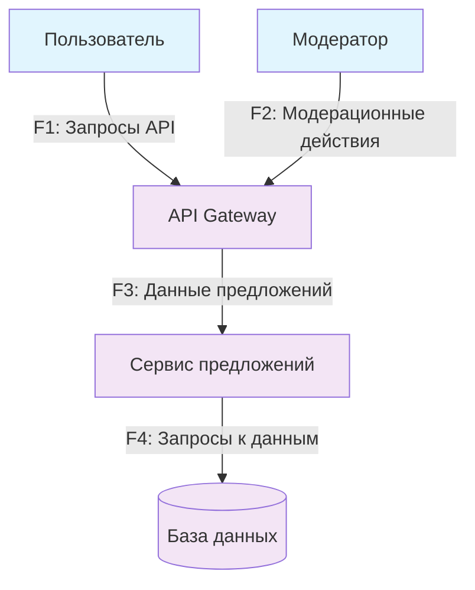
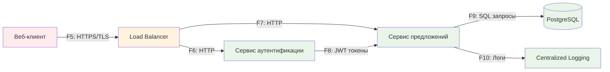
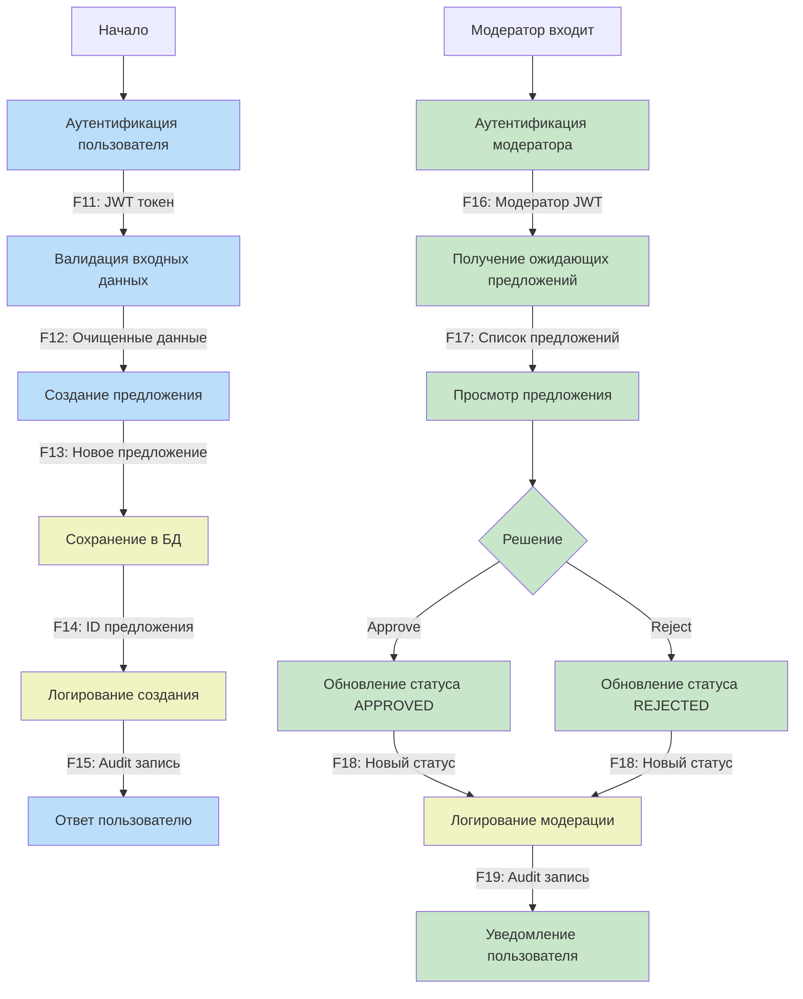

# Data Flow Diagrams для Suggestion Box

## Контекстная диаграмма (Уровень 0)

## Логическая архитектура (Уровень 1)

## Диаграмма процессов (Уровень 2)

## Границы доверия

- External - Клиенты (ненадежная зона)
- Boundary - Edge services (демилитаризованная зона)
- Internal - Бэкенд сервисы (доверенная зона)
- User Processes - Процессы обычного пользователя
- Moderator Processes - Процессы модератора (привилегированная зона)
